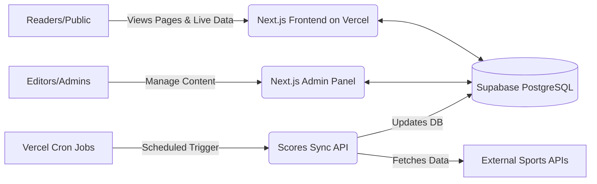

# Khelardesh Platform Handover Document

## 1. PROJECT OVERVIEW

Khelardesh is a modern, dynamic sports news and live-score platform serving sports enthusiasts in Bangladesh. It provides real-time match updates, comprehensive articles, and engaging content across multiple sports (football, cricket, tennis, etc.) entirely in Bengali. The platform features both a public-facing reader experience and a secure, bespoke Admin Dashboard for the editorial team to publish news, manage live scores, and control advertisements.

**Core Technologies (The "Tech Stack")**
*   **Next.js (React):** The core framework powering the website, chosen for its speed, SEO optimization, and seamless integration of server-side logic with client-side interfaces.
*   **Supabase (PostgreSQL):** The database and backend-as-a-service provider, chosen for its robust relational data structure, real-time update capabilities, and built-in security features.
*   **Vercel:** The hosting and deployment platform, chosen because it is the creators of Next.js, offering automatic scaling, edge networking, and zero-configuration deployments.
*   **Tailwind CSS:** The styling framework, chosen for rapid, responsive UI development without the need for complex custom CSS files.

---

## 2. ARCHITECTURE SUMMARY

The system architecture is designed to be serverless, meaning there are no traditional physical servers to maintain; everything scales automatically based on traffic.

**Data Storage (Database Tables)**
The database is structured into several interconnected tables:
*   **Article:** Stores all news stories, including headlines, content, media links, and publication status (draft/published).
*   **ScoreCard:** Stores live and completed match scores, teams, and statuses.
*   **SiteUser:** Stores registered reader profiles (if reader accounts are enabled).
*   **Comment & CommentReaction:** Stores reader comments on articles and the associated likes/reactions.
*   **Sponsor / AdConfig:** Stores details about current advertisers and specific configuration for ad placements (e.g., ensuring mutually exclusive ad displays).
*   **AdminSession / Composer:** Manages secure login sessions for administrators and editorial staff.
*   **SidebarContent:** Manages dynamic content (trivia, history, fixtures) displayed alongside main articles.

**Live Data Pipeline**
The platform automatically fetches real-time sports data from external sources (SofaScore / FotMob). Vercel runs a "Cron Job" (an automated, scheduled task) that triggers an internal API route (`/api/cron/sync-scores`) at regular intervals. This script pulls fresh scores, updates the `ScoreCard` table in Supabase, and instantly pushes those updates to readers viewing the site.

---

## 3. ACCESS & CREDENTIALS

To fully manage and own this application, your team requires access to the following services:

1.  **Vercel**
    *   *Purpose:* Hosts the website, manages the domain routing, and runs the automated background jobs.
    *   *Plan:* Currently on the standard tier. Contains all environment variables (the "secret keys" connecting the app to the database).
2.  **Supabase**
    *   *Purpose:* Hosts the database, authenticates admins, and powers real-time features.
    *   *Plan:* Free tier limits apply (database size up to 500MB, up to 200 concurrent real-time connections, etc.).
3.  **Domain Registrar**
    *   *Purpose:* Where the `khelardesh.com` domain name is registered and DNS records are managed.
4.  **GitHub**
    *   *Purpose:* Stores the actual source code repository. Vercel automatically deploys new code whenever changes are pushed here.
5.  **External APIs (Optional)**
    *   If using paid API tiers for sports data in the future, those credentials will need management.

> **CRITICAL RULE:** No actual passwords, database connection strings, or secret API keys are stored in this document or in the codebase itself. All secrets must securely live in the **Vercel Environment Variables** settings panel.

---

## 4. SECURITY POSTURE

A comprehensive security audit has been recently conducted and remediated to ensure the platform is safe from unauthorized access and data leaks.

**Row Level Security (RLS)**
Row Level Security is a database feature that acts as a bouncer for your data. Even if a malicious user bypasses the website and tries to talk to the database directly, RLS policies explicitly define who can read or write what. 
*   **Status:** RLS is fully enabled across all tables. For example, the `Article` table has strict rules ensuring the public can *only* read articles where `status = 'published'`. Drafts are fundamentally invisible to the public.

**Admin Access Control**
The Admin Panel requires secure authentication. Unauthenticated users cannot view admin pages or execute admin actions. All sensitive write operations (creating articles, deleting comments) are executed securely on the server-side, never trusting the user's browser.

**The Service Role Key (CRITICAL)**
Supabase provides two main keys: an "anon" (anonymous) key safe for public use, and a "service_role" key. 
*   The **service_role key** is a master key that *completely bypasses all database security (RLS)*. 
*   This key must **never** be exposed in the browser, sent to the client, or committed to GitHub. It is securely stored in Vercel. If this key is leaked, an attacker gains full read/write/delete access to your entire database.

**Past Incidents & Remediation**
*   *Incident:* There was a prior instance where a sensitive database key was inadvertently exposed, leading to unauthorized data access/manipulation.
*   *Remediation:* The compromised key was immediately revoked and rotated. The entire codebase was audited to remove any hardcoded keys. Furthermore, strict Row Level Security (RLS) policies were applied to the database, ensuring that even if the public `anon` key is used, destructive actions are fundamentally blocked at the database level. Draft leakage vulnerabilities were also patched by strictly enforcing the `published` status on all public APIs and page generation functions.

**Ongoing Security Action Items**
*   Ensure that any future developers strictly adhere to the established pattern of using the `supabaseAdmin` client only within secure, server-side API routes or Server Components.
*   Regularly rotate passwords for the Vercel and Supabase dashboards.

---

## 5. ADMIN PANEL GUIDE

The bespoke Admin Panel is located at `/admin` and requires secure login credentials.

*   **Login:** Access `/admin/login` and enter your authorized credentials.
*   **Articles:** Navigate to the Articles section to write new stories, edit existing ones, or change their status between "Draft" and "Published." Only published articles will appear on the live site.
*   **Live Scores:** The ScoreCards section allows you to view currently synced matches. You can manually pin matches to ensure they appear prominently on the homepage, or hide matches that are irrelevant.
*   **Sponsors & Ads:** Manage advertising banners in the Sponsors section. The system includes logic to ensure that competing sponsors (e.g., mutually exclusive brands) do not appear in the same ad slot simultaneously.
*   **Dashboard:** View real-time readership analytics, including active live viewers (powered by Supabase Realtime) and total historical article views.

---

## 6. MAINTENANCE & OPERATIONS

The serverless architecture minimizes required day-to-day maintenance, but certain operational limits must be monitored.

**Automated Operations (No Maintenance Required)**
*   Server provisioning, OS updates, and scaling for high traffic are automatically handled by Vercel.
*   Database backups and infrastructure are managed by Supabase.

**Periodic Maintenance Requirements**
*   **Supabase Limits:** The project currently operates within Supabase limits. You must periodically check the Supabase Dashboard for:
    *   *Database Size:* If it approaches the 500MB free limit, you will need to upgrade to a paid Pro plan to avoid service interruption.
    *   *Concurrent Connections:* If live traffic spikes significantly, the Realtime presence tracking might hit the free tier cap.
*   **Dependency Updates:** Future developers should periodically update Next.js, React, and other NPM packages to receive security patches and performance improvements.
*   **Monitoring Live Scores:** If live scores stop updating on the homepage, check the "Logs" section in the Vercel Dashboard for the `sync-scores` cron job. Failures usually indicate that the external sports API has changed its format or is temporarily down.

---

## 7. KNOWN LIMITATIONS & FUTURE RECOMMENDATIONS

**Current Limitations & Technical Debt**
*   *External Score Reliability:* The platform currently relies on scraping/fetching from undocumented or unofficial APIs (like FotMob/SofaScore) for some live scores. These APIs can change without warning, which will break the score sync. 
*   *Caching Overlap:* Some areas of the site heavily utilize Next.js static caching to handle high traffic efficiently. This means updates to articles might take a few moments to propagate to all users globally.

**Future Recommendations**
1.  **Official Data Provider:** If the platform scales and live scores become mission-critical, strongly consider licensing an official sports data API (e.g., Sportradar, Opta) to guarantee uptime and legal compliance.
2.  **Staging Environment:** Setup a secondary "Staging" Vercel project linked to a secondary Supabase database. This allows developers to test new features without risking breaking the live production site.
3.  **Error Monitoring:** Integrate a service like Sentry to automatically alert your technical team the moment a bug occurs in the browser or on the server.
4.  **Automated Backups:** While Supabase handles basic backups, setting up automated logical backups (e.g., via pg_dump to an AWS S3 bucket) is recommended for absolute data safety.

---

## 8. SUPPORT & HANDOVER CONTACT

[Placeholder: Support terms, SLA details, and warranty period details go here]

**Primary Technical Contact:**
*   Name: [To be filled by developer]
*   Email: [To be filled by developer]
*   Phone: [To be filled by developer]
